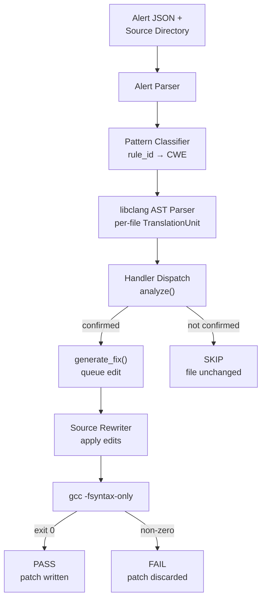

# SafeRepair

> Deterministic, AST-guided automated repair for C memory-safety vulnerabilities.


SafeRepair is a deterministic, AST-guided program repair tool for C that automatically generates verified fixes for common memory-safety vulnerabilities. **No machine learning. No training data. No GPU.**

| Repairs | Accuracy | False Positives | Repositories |
|---:|---:|---:|---:|
| **328** | **99.7%** | **0** | **15** |

<!--
  Add a technical report if you have one:
  📄 Full technical report available in `docs/report.pdf`.
-->

## Key Achievements

- **328** vulnerabilities repaired
- **99.7%** repair accuracy
- **Zero** false positives
- **15** open-source repositories evaluated
- AST-guided, deterministic repair — no machine learning

## Motivation

Modern static-analysis tools can detect thousands of potential vulnerabilities in large C codebases. SafeRepair focuses on the next step: automatically generating conservative, AST-verified repairs for a subset of high-confidence vulnerability patterns, while guaranteeing zero false-positive patches.

## Overview

Static analysis tools like `clang-tidy` catch memory-safety bugs in C codebases reliably. Fixing them is still manual, and it's repetitive — the same handful of transformations get applied over and over on any codebase with a real alert backlog. SafeRepair automates that last step for four well-characterized bug classes, with a hard guarantee: **it never writes a wrong patch**. If a handler can't confirm the vulnerability structure in the AST, it does nothing and leaves the file byte-for-byte unchanged.

This design makes SafeRepair suitable for integration into automated code-review and CI workflows, where conservative repairs are preferred over speculative fixes.

## Demo

Example run against a project with confirmed alerts:

```bash
$ python pipeline.py --alerts alerts.json --source-dir ./mpc --output-dir ./patched

[PASS] src/mpc.c:142   SUSP_REALLOC   realloc guarded via temporary pointer
[PASS] src/mpc.c:210   MISSING_NULL   null check inserted, return type: mpc_parser_t*
[SKIP] src/mpc.c:305   MISSING_NULL   return type ambiguous, left unchanged
[PASS] src/mpc.c:412   INDEX_CHECK    bounds check reordered before array access
[PASS] src/mpc.c:588   SPRINTF_UNBOUNDED   sprintf → snprintf, size bound added

5 alerts processed — 4 PASS, 1 SKIP, 0 FAIL
```

<!--
  Replace the block above with a real captured terminal run once you have one —
  actual tool output (with a real timestamp/repo) is more convincing than a
  constructed example. A short GIF of this running is even better:
  

  Also worth adding once available:
  ## Example Patch
  
-->

## Architecture

<!-- This block renders as an interactive diagram directly on GitHub — no separate image file needed. -->



Every handler follows the same two-phase, **right-or-silent** contract:

1. **`analyze()`** — regex-matches the source line, then confirms the match against the libclang AST. Returns a context dict on success, `None` on any failure. Purely read-only.
2. **`generate_fix()`** — builds the replacement text from that context alone and queues it with the rewriter. Only called if `analyze()` succeeded.

There is no partial-fix path. This is what makes the zero-false-positive result hold **by construction**, not by luck of the evaluation set.

## Supported Vulnerabilities

| CWE | Pattern | Trigger | Fix |
|---|---|---|---|
| CWE-401/690 | Suspicious `realloc` usage | `p = realloc(p, size)` — leaks/nulls `p` on failure | Routes through a temporary pointer, only reassigns on success |
| CWE-690 | Missing null check after `malloc` | Dereference with no NULL guard | Inserts a guard block with a return value inferred from the enclosing function's type |
| CWE-125/787 | Index-before-bounds-check | `buf[j] && j < N` — access before the check | Swaps operands so the bounds check short-circuits first |
| CWE-120 | Unbounded `sprintf` | `sprintf(buf, "%s", s)` — no size cap | Rewrites to `snprintf` with `sizeof(buf)` inserted |

<details>
<summary><b>Example: Suspicious realloc fix</b></summary>

```c
/* Before */
i->marks = realloc(i->marks, sizeof(mpc_state_t) * i->marks_slots);

/* After */
{
    void *_sr_tmp = realloc(i->marks, sizeof(mpc_state_t) * i->marks_slots);
    if (_sr_tmp != NULL) {
        i->marks = _sr_tmp;
    }
    /* else: realloc failed, i->marks still valid */
}
```
</details>

<details>
<summary><b>Example: Missing null check fix</b></summary>

```c
/* Before */
struct Graph *graph = malloc(sizeof(struct Graph));
graph->numVertices = vertices;

/* After */
struct Graph *graph = malloc(sizeof(struct Graph));
if (graph == NULL) { return NULL; }
graph->numVertices = vertices;
```
</details>

<details>
<summary><b>Example: Index-check reorder fix</b></summary>

```c
/* Before */
for (j = 0; p[j] && j < HUD_BUF_SIZE; j++) {

/* After */
for (j = 0; j < HUD_BUF_SIZE && p[j]; j++) {
```
</details>

<details>
<summary><b>Example: sprintf → snprintf fix</b></summary>

```c
/* Before */
sprintf(keym, "%s:", s);

/* After */
snprintf(keym, sizeof(keym), "%s:", s);
```
</details>

## Results

Evaluated on 372 alerts across 15 open-source C repositories — text editors, database engines, game engines, network daemons, and a language runtime — including SQLite, CPython, Vim, Netdata, and Radare2, with **no repository-specific tuning**.

| Pattern | Alerts | PASS | SKIP | FAIL | Rate (confirmed) | Rate (overall) |
|---|---:|---:|---:|---:|---:|---:|
| Suspicious Realloc | 180 | 168 | 12 | 0 | 100% | 93% |
| Missing Null Check | 24 | 6 | 18 | 0 | 100% | 25% |
| Index Check | 108 | 102 | 5 | 1 | 99% | 94% |
| Sprintf Unbounded | 60 | 52 | 8 | 0 | 100% | 87% |
| **Total** | **372** | **328** | **43** | **1** | **99.7%** | **88.2%** |

The 43 skips are not failures — each one left its source file untouched, split across four categories: macro-expanded lines, interprocedural patterns, dynamically sized buffers, and code already fixed upstream. The single failure (in `vim`, index-check pattern) came from a multi-line condition with nested ternaries that the text-level operand search didn't span.

## Installation

```bash
git clone https://github.com/<your-username>/saferepair.git
cd saferepair
pip install -r requirements.txt
```

### Prerequisites

- Python 3.11+
- `libclang` (Python bindings) — tested against 18.1.1
- `clang-tidy` — tested against 21.1.8 (for generating input alerts)
- GCC — tested against 6.3.0 (for patch validation)

<!--
  Short structure overview — trim/expand to match your real repo layout:

  saferepair/
  ├── handlers/       # one module per CWE pattern
  ├── pipeline.py      # orchestrates parsing → dispatch → rewrite → validate
  ├── validator.py     # gcc -fsyntax-only check
  ├── docs/
  └── README.md
-->

## Usage

```bash
python pipeline.py \
  --alerts alerts.json \
  --source-dir /path/to/project \
  --output-dir ./patched
```

`alerts.json` is an array of alert objects, each with a `rule_id`, `line`, and either a `file` (relative to `--source-dir`) or `file_path` field:

```json
[
  { "rule_id": "bugprone-suspicious-realloc-usage", "file": "src/parser.c", "line": 142 },
  { "rule_id": "clang-analyzer-unix.Malloc", "file": "src/graph.c", "line": 58 }
]
```

Each source file in `--output-dir` carries a `PASS`, `SKIP`, or `FAIL` status. `PASS` files contain the applied patch; `SKIP` and unpatched files are byte-for-byte identical to the source.

<!--
  Confirm these flags match your real CLI before publishing.
-->

## Design Philosophy

> **Repair only when correctness can be proven.**
>
> If SafeRepair cannot verify the vulnerability structure through AST analysis, it leaves the source code unchanged.

Every handler does exactly one of two things: confirm the vulnerability structure in the AST **and** produce a correct fix, or return nothing. There is no partial-fix path. That's what makes the zero-false-positive guarantee matter more than raw fix rate in a pipeline where patches land before human review.

## Limitations

- **Local-context only.** No interprocedural analysis — bugs whose confirmation requires crossing a function boundary are skipped.
- **Macro-expanded call sites** aren't resolved through libclang's token-expansion API yet, so macro-wrapped `realloc`/`malloc` calls are skipped.
- **Dynamically sized buffers** in the `sprintf` handler are skipped, since `sizeof(ptr)` can't recover heap allocation size.
- **Return-type ambiguity** in the null-check handler (struct returns, non-standard error codes) has no clean local-analysis solution — currently a hard skip.

## Roadmap

- LLVM IR-level repair for broader language and toolchain applicability
- Additional CWE handlers: null pointer dereference (CWE-476), double free (CWE-415), integer overflow (CWE-190)
- Lightweight interprocedural analysis (same-file call chains)
- GitHub Actions integration with automatic pull-request creation
- C++ support

## Acknowledgements

Developed as part of a B.Tech project at Delhi Technological University under the guidance of Akshay Mool.
